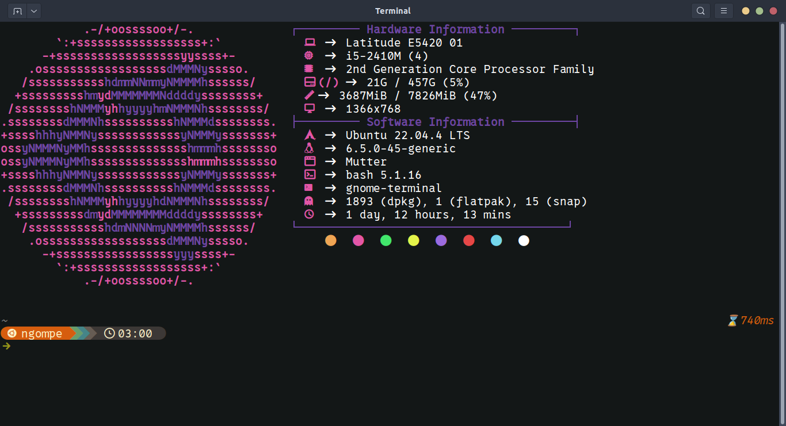

# 21 Terminal Profile



This is my profile for UNIX or Ubuntu, I just use the default the gnome-terminal app.

These commands were last tested on August 2024 on Ubuntu 22.04.

```bash
# Update your software repositories.
sudo apt-get update
sudo apt-get upgrade

# Install Git.
sudo apt-get install -y git

```

# Installation
**Go to the path of the clone git**

```bash
cd path/to/21-terminal
```

### Starship

First, we'll install the [Starship](https://starship.rs/) a minimal, blazing-fast, and infinitely customizable prompt for any shell!

```bash
./install_01.sh
```

### Font, Ble.sh and termisl colour

The shell that I use is "Bash", the script below will:
- Install the font and set it as terminal font, I used the _0xProto_ Nerd Font at 12.
- Change the Background of the terminal
- Install ble.sh, which is the tool i used of autocompletion

```bash
./install_02.sh
```
**For any issue or complain use the Issues to let's me know, i will be happy to work with**

